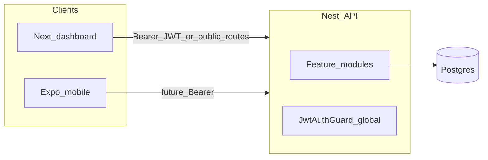

# Axtella Property Management Co. — operations runbook

Single place for how the monorepo runs, how auth works, and how to verify it. Update this file when ports, env vars, or major routes change.

## 1. Environment (source of truth)

Copy examples to real env files (**never commit secrets**).

| App | File | Purpose |
|-----|------|---------|
| API | [apps/backend/.env.example](../apps/backend/.env.example) | Postgres, JWT, CORS, `PORT`, optional **`ALLOW_PUBLIC_REGISTER`** (`0` / `false` / `no` / `off` disables **`POST /api/v1/auth/register`**) |
| Web | [apps/frontend/.env.example](../apps/frontend/.env.example) | Optional `NEXT_PUBLIC_API_BASE_URL` (unset = `/api/v1` proxy), `NEXT_PUBLIC_API_ORIGIN`, optional `NEXT_PUBLIC_DEFAULT_PROPERTY_ID`, optional `NEXT_PUBLIC_BRAND_MODULE`, optional **`NEXT_PUBLIC_ENABLE_SELF_SIGNUP`** (`0` / `false` hides **Create account** on `/login`). Static **[commercial-ui-fallback.css](../apps/frontend/public/commercial-ui-fallback.css)** is linked from the root layout so the commercial shell and **dashboard KPI / module grids** still style if `/_next/static/css/*` fails to load. |
| Mobile | [apps/mobile/.env.example](../apps/mobile/.env.example) | `EXPO_PUBLIC_API_BASE_URL` |

### Backend checklist (`apps/backend/.env`)

- `PORT` — API listen port (default **3000**).
- `DB_*` — Postgres host, port, user, password, database name. After any password change, **`DB_PASSWORD` must match** what Postgres stores for **`DB_USERNAME`** (character-for-character). From `apps/backend`, run **`npm run db:check`** — it runs `SELECT 1` using `.env`; if it fails with **password authentication failed**, connect as a **superuser** (e.g. `postgres` in pgAdmin) and run: **`ALTER ROLE your_app_user WITH PASSWORD 'same_string_as_DB_PASSWORD';`** (or create the role if missing — see [db-maintenance.md](./db-maintenance.md)).
- `JWT_SECRET` — long random string in production (no default like `change-me` in prod).
- `JWT_EXPIRES_IN` — e.g. `7d` (see `jsonwebtoken` / Nest JWT docs).
- `CORS_ORIGIN` — comma-separated browser origins. If **unset**, the API allows **http://localhost:3001** and **http://127.0.0.1:3001** by default. If **set**, only listed origins are allowed (include both hosts if you open the app via either URL).
- **`ALLOW_PUBLIC_REGISTER` (optional)** — If **`0`**, **`false`**, **`no`**, or **`off`**, **`POST /api/v1/auth/register`** returns **403** with a short message. **Unset** or empty keeps registration enabled (matches existing e2e and local dev). Use **`0`** in production when users are created only via seed, SQL, or operations.

### Frontend checklist (`apps/frontend/.env.local` or `.env`)

- **`NEXT_PUBLIC_API_BASE_URL` (optional)** — If **unset**, the browser calls same-origin **`/api/v1`**, and the App Router handler [`app/api/v1/[...path]/route.ts`](../apps/frontend/app/api/v1/%5B...path%5D/route.ts) **proxies** to Nest using **`API_PROXY_TARGET`** (default **`http://127.0.0.1:3000`**). Set **`API_PROXY_TARGET`** to the **API origin only** (no trailing **`/api/v1`**). That avoids **localhost vs 127.0.0.1 vs LAN IP** mismatches and CORS issues during local login. For split production hosting, set the full API base (must include **`/api/v1`**; [api.ts](../apps/frontend/lib/api.ts) can append it).
- `NEXT_PUBLIC_API_ORIGIN` — Where Nest serves **`/docs`** (e.g. `http://127.0.0.1:3000`) when using the proxy; used by the Developer page hint.
- `NEXT_PUBLIC_DEFAULT_PROPERTY_ID` (optional) — UUID for profit & loss and income-expense pages when not hard-coded.
- `NEXT_PUBLIC_BRAND_MODULE` (optional) — white-label tile for the dashboard top bar and module-branded pages (`fms`, `avl`, `iots`, `eagleEye`; case-insensitive; `eagle-eye` accepted). Default **`fms`**. See [brand-module-logos.ts](../apps/frontend/lib/brand-module-logos.ts) (`getPublicBrandModule`).
- **`NEXT_PUBLIC_ENABLE_SELF_SIGNUP` (optional)** — If **`0`** or **`false`**, the login page hides **Create account** and only offers sign-in. **Unset** or any other value keeps the toggle visible (local dev default). Pair with **`ALLOW_PUBLIC_REGISTER`** on the API in production.

### Mobile checklist (`apps/mobile/.env`)

- `EXPO_PUBLIC_API_BASE_URL` — same base as above when the device/emulator can reach the API (use machine LAN IP for physical devices, not `localhost`).

## 2. Ports and CORS (local dev)

| Service | Default port | Notes |
|---------|--------------|-------|
| Nest API | **3000** | `PORT` in backend `.env` |
| Next.js dashboard | **3001** | `next dev -p 3001` in [apps/frontend/package.json](../apps/frontend/package.json). From another device on your LAN, use **`npm run dev:lan`** and open `http://<your-ip>:3001/login`. |
| Swagger UI | **3000** `/docs` | Same process as the API |

CORS is configured in [apps/backend/src/main.ts](../apps/backend/src/main.ts). Preflight allows typical methods and headers (`Content-Type`, `Authorization`, `Accept`).

### Static CSS: `/_next/static/css` vs fallback

If the **home** dashboard shows **plain stacked text** (no KPI cards or module link tiles) but **login** still looks correct, the Next.js webpack CSS chunks may not be applying (failed request, strict network, or proxy stripping `/_next`).

1. Open **DevTools → Network**, filter **CSS**, reload. Confirm **`/_next/static/css/*.css`** returns **200**.
2. **`/commercial-ui-fallback.css`** (linked from [layout.tsx](../apps/frontend/app/layout.tsx)) still loads **shell + auth + dashboard grid/card** rules when the bundle CSS is missing; if both are broken, check the **Next** dev server and that you open the app on the **Next** port (**3001**), not the API.

### Browser login, API base URL, and session

These behaviors matter when **Postman works but the browser does not** (CORS, wrong URL, or stale tokens).

| Topic | Behavior |
|-------|----------|
| **CORS defaults** | With **`CORS_ORIGIN` unset**, both `http://localhost:3001` and `http://127.0.0.1:3001` are allowed. With **`CORS_ORIGIN` set**, only the listed origins are used — add both if you use both. |
| **API base URL** | With **`NEXT_PUBLIC_API_BASE_URL` unset**, the UI uses **`/api/v1`** on the **same host as Next**. Next forwards to Nest only via the App Router catch-all ([`app/api/v1/[...path]/route.ts`](../apps/frontend/app/api/v1/%5B...path%5D/route.ts)) (Node runtime), using **`API_PROXY_TARGET`** (default **`http://127.0.0.1:3000`**). There are **no** `next.config` rewrites for `/api/v1` (so an unreachable Nest yields **503 JSON** from that route instead of an opaque **500**). Set **`API_PROXY_TARGET`** to the **API origin only** (no trailing **`/api/v1`**). If **`NEXT_PUBLIC_API_BASE_URL`** points at **another** host (real split deployment), the browser calls that URL directly ([`api.ts`](../apps/frontend/lib/api.ts)). If it mistakenly points at **this Next app** (same host/port as the UI, e.g. port **3001**), [`api.ts`](../apps/frontend/lib/api.ts) and the proxy route **fall back to same-origin `/api/v1`** so requests are not stuck with **404 proxy disabled**. |
| **Login request** | With the default same-origin **`/api/v1`** proxy, the login page and other authenticated **`fetch`** calls use **`credentials: 'same-origin'`** (via **`credentialsForApi()`** in [`api.ts`](../apps/frontend/lib/api.ts)); with **`NEXT_PUBLIC_API_BASE_URL`** set to a full URL, they use **`credentials: 'include'`** (CORS must allow the UI origin). |
| **Errors** | `formatApiErrorMessage` maps common Nest JSON shapes (`message` string or array, `error` + `statusCode`) for POST/PATCH/DELETE. Authenticated **GET** failures also parse the response body (`formatGetErrorMessage` in [`api.ts`](../apps/frontend/lib/api.ts)). See **Module load errors** below. |
| **Stale JWT** | If **`GET /api/v1/auth/me`** returns **401**, [`AppShell`](../apps/frontend/components/AppShell.tsx) **clears** the stored token and redirects to **`/login?session=invalid`** only when the token in storage **still matches** the one used for that request (so a late 401 from an **old** JWT does not wipe a **new** session after sign-in). Cancelled Strict Mode runs do not clear the token. **`AUTH_CHANGED`** triggers a fresh **`/auth/me`** on app routes (not on **`/login`**). The login page shows a notice when **`session=invalid`**. |

### Quick Login Troubleshooting (operators)

Use this quick checklist when sign-in issues are reported from the browser:

- Use one hostname consistently (**`localhost`** vs **`127.0.0.1`**) so session storage matches the app URL.
- Local default: API on port **3000**, app on **3001**. Start Nest first (`cd apps/backend` then `npm run db:check` and `npm run start:dev`).
- If the form shows unreachable API / **503** / timeout, API is not running or Postgres is down.
- If sign-in fails with **"Invalid email or password"**, run `npm run db:seed-dev-user` from `apps/backend`.
- If clicking **SIGN IN SECURELY** never sends `POST /api/v1/auth/login` (DevTools → Network), reload and check `/_next/static/chunks/main-app.js`:
  - if **404**, stop Next, run `rm -rf .next` in `apps/frontend`, then run `npm run dev` again.
- If sign-in appears successful but returns to login, browser storage may be blocked:
  - allow site data for that host or disable strict private mode.
  - app falls back to session storage when local storage is unavailable.
- **CREATE ACCOUNT** requires API-side enablement: `ALLOW_PUBLIC_REGISTER` must not be `0`/`false` in `apps/backend/.env`.
  - UI checks `GET /api/v1/auth/public-config`.
- See [login/page.tsx](../apps/frontend/app/login/page.tsx) for the exact in-app operator hints.

### Next `/api/v1` proxy troubleshooting

- **Next dev exits** with *“You cannot use both an required and optional catch-all route at the same level”* — Under **`app/api/v1/`** you must have **only one** of **`[...path]`** or **`[[...path]]`**. This repo uses **`[...path]/route.ts`** only; remove any duplicate optional catch-all so **`npm run dev`** can start.
- **`(Failed to fetch)`** on login — The browser never received a normal HTTP response (unlike **503 JSON** from **`/api/v1`** when Next is up but Nest is down). Confirm **`npm run dev`** in **`apps/frontend`** actually started (see above if it exited immediately), Nest is listening on **3000**, then use **DevTools → Network** and retry; rule out ad blockers and strict privacy modes on **`localhost`**. If Next is healthy, **`curl http://127.0.0.1:3001/api/v1/health`** should return **200** when Nest is up, or **503** JSON when Nest is not.

### Module load errors (dashboard registers)

Pages that use [ModuleDataPage](../apps/frontend/components/ModuleDataPage.tsx) surface clearer failures than a bare HTTP status:

- **Failed GETs:** [api.ts](../apps/frontend/lib/api.ts) reads the response body and includes Nest messages in the thrown error (`formatGetErrorMessage`, reusing `formatApiErrorMessage`). Pure network failures (no HTTP response) explain checking **`API_BASE`**, backend port **3000**, and Next on **3001**.
- **Hints on the page:** `ModuleDataPage` adds short next-step text for common patterns (e.g. **404** on `/catalog-item-groups` vs `/catalog-items`, **403**, **500**, non-JSON). **Open login** is shown only when the message indicates not signed in, **401**, or session expiry—not for **404**/**500** alone.
- **Wrong JSON shape (HTTP 200):** List endpoints should return `{ "items": [...], "total": number }`. If the payload does not match, [GenericModuleRegistry](../apps/frontend/components/module-registry/GenericModuleRegistry.tsx) shows **Unexpected response shape** with that contract and suggests DevTools **Network** for the same request.

**Verification:** After pulling frontend changes, hard-refresh the browser or restart **`npm run dev`** in **`apps/frontend`**. From **`apps/frontend`**, **`npx tsc --noEmit`** should pass. Open a register page (e.g. **Services & catalog → Groups** at `/items/groups`): you should see data or a detailed error banner. For **404** on **`/api/v1/catalog-item-groups`** or **`/api/v1/catalog-items`**, rebuild and restart Nest (`npm run build` in **`apps/backend`**) and run **`npm run db:migrate`** (migrations **018**–**019**). A **401** without a JWT on protected routes is normal; **404** usually means an old API binary or wrong path.

### Login verification (curl + browser Network)

Use this after changing the proxy route, **`API_PROXY_TARGET`**, or auth shell code. **Restart the Next dev server** first (stop `npm run dev` in `apps/frontend` and start it again after pulls—hot reload does not always clear odd client state).

**When `curl` through Next succeeds but the browser still misbehaves:** keep **one origin** for the whole session—use either **`http://localhost:3001`** or **`http://127.0.0.1:3001`**, not both (`localhost` and `127.0.0.1` are different for storage and cookies). Hard refresh or an incognito window rules out cache and extensions.

1. **Terminal (same machine):** confirm Nest (**3000**) and Next (**3001**) are up. Compare **direct API** vs **through Next** (should both return JSON with **`access_token`** on login and **200** on **`/auth/me`** with a Bearer token):

```bash
# Health
curl -sS -o /dev/null -w "Nest health: %{http_code}\n" http://127.0.0.1:3000/api/v1/health
curl -sS -o /dev/null -w "Next proxy health: %{http_code}\n" http://127.0.0.1:3001/api/v1/health

# Login + /auth/me via Next (swap 127.0.0.1 for localhost if that is what you use in the browser)
TOKEN=$(curl -sS -X POST http://127.0.0.1:3001/api/v1/auth/login \
  -H 'Content-Type: application/json' \
  -d '{"email":"dev@example.com","password":"AxtellaDev2024!"}' \
  | python3 -c "import sys,json; print(json.load(sys.stdin).get('access_token',''))")
curl -sS -o /dev/null -w "auth/me via Next: %{http_code}\n" \
  -H "Authorization: Bearer $TOKEN" http://127.0.0.1:3001/api/v1/auth/me
```

2. **Browser:** open the UI on the **same host** you used in **`curl`**. **DevTools → Network:** run **one** sign-in attempt and inspect **`auth/login`** then **`auth/me`**. For **`auth/me`**, open the request → **Headers** → confirm **`Authorization: Bearer …`** is present on the request.

**Interpreting status codes**

| What you see | Likely cause | Next step |
|----------------|---------------|-----------|
| **`auth/login` 401** | Wrong password, missing user, or validation error | Read response JSON **`message`**; from `apps/backend` run **`npm run db:seed-dev-user`** if the dev user is missing, then sign in as **`dev@example.com`** / **`AxtellaDev2024!`**. |
| **`auth/login` 503** with JSON from Next | Proxy cannot reach **`API_PROXY_TARGET`** | Start Nest; check [`app/api/v1/[...path]/route.ts`](../apps/frontend/app/api/v1/%5B...path%5D/route.ts), **`API_PROXY_TARGET`**, and **`apps/frontend/.env.local`**. |
| **`auth/login` 200**, **`auth/me` 401** | JWT not accepted, token not sent, or proxy stripping **`Authorization`** | Confirm **`Authorization: Bearer …`** on the **`auth/me`** request; compare direct **`curl`** to port **3000** vs through **3001**; keep **`JWT_SECRET`** stable in backend **`.env`**. |
| **`auth/login` 200**, **`auth/me` 200**, still sent to **`/login?session=invalid`** | Unusual after full-page post-login and **`AbortController`** on **`/auth/me`** | Capture **both** response bodies and **`auth/me`** request headers; only then consider a targeted app change (needs that evidence). |
| **`curl` OK, browser fails** | Different origin than **`curl`**, stale bundle, or blocked storage | Same host as **`curl`**, hard refresh; if the login form shows a storage/read-back error, allow site data for that host or disable strict private mode. |

If problems remain, capture **HTTP status**, **response body**, and **request headers** (especially **`Authorization`**) for **`auth/login`** and **`auth/me`** from the Network panel for one attempt.

**Code changes:** do not guess—use the table above. Further frontend changes are only justified when a row matches and you still have a reproducible trace.

### Production build and Playwright smoke test

1. **Production parity:** From **`apps/frontend`**, run **`npm run build`** then **`npm run start`** (serves on **3001** by default). Repeat the **`curl`** checks or a manual browser sign-in; the **`/api/v1`** Route Handler runs the same way as in dev. If **`next build`** fails with **PageNotFoundError** (e.g. manifest or icon routes), remove **`apps/frontend/.next`** and rebuild—stale output can confuse the App Router after pulls.
2. **Automated smoke test:** With Nest on **3000** and Next on **3001** (dev or **`next start`**), from **`apps/frontend`** run **`npm run test:e2e`**. [Playwright](https://playwright.dev/) runs **`auth-proxy.spec.ts`** (API through Next) and **`login-browser.spec.ts`** (real browser sign-in + redirect). Override base URL with **`E2E_BASE_URL`**. First-time setup: **`npm run test:e2e:install`** (Chromium). If the app is down, tests **skip** with a short message. If **`login-browser`** skips because the login page **did not hydrate**, check DevTools → Network for **404** on **`/_next/static/chunks/main-app.js`** or **`app-pages-internals.js`** — stop **`next dev`**, run **`rm -rf .next`** in **`apps/frontend`**, start **`npm run dev`** again, then re-run **`npm run test:e2e`**.

**If login still fails**, check in order:

1. You are on the **Next** app (**port 3001**), not the API (**port 3000**). Login URL: **`http://localhost:3001/login`** (or `http://127.0.0.1:3001/login`).
2. API up and DB reachable: **`GET /api/v1/health/ready`** on port **3000** returns **200**. From `apps/backend`, **`npm run db:check`** must succeed; if it reports **password authentication failed**, run **`ALTER ROLE … WITH PASSWORD '…'`** in Postgres so the role matches **`DB_PASSWORD`** in `.env`, then restart Nest.
3. **`users`** table exists ([create-users-table.sql](../apps/backend/sql/create-users-table.sql) if needed). Run **`npm run db:seed-dev-user`** once to create the table and dev user together.
4. A user exists: migration **[008_seed_dev_user.sql](../apps/backend/src/database/migrations/008_seed_dev_user.sql)**, **`POST /api/v1/auth/register`** (Swagger/Postman) if **`ALLOW_PUBLIC_REGISTER`** is not disabled, or **Create account** on `/login` if **`NEXT_PUBLIC_ENABLE_SELF_SIGNUP`** is not **`0`/`false`**; password **≥ 8** characters.
5. **`JWT_SECRET`** in backend `.env` is stable (changing it invalidates existing tokens — sign in again).
6. **Login page looks stuck or shows no message:** hard-refresh the browser (cache-bypass) after pulling frontend changes. Open **DevTools → Network**, submit the form, and confirm **`POST /api/v1/auth/login`** or **`POST /api/v1/auth/register`** runs. If nothing appears in Network, check **Console** for hydration or JavaScript errors. The login form shows a status line (“Contacting sign-in service…”) while the request runs and a red alert for validation or API errors ([`login/page.tsx`](../apps/frontend/app/login/page.tsx)).

## 3. Database

- TypeORM: [apps/backend/src/config/orm.config.ts](../apps/backend/src/config/orm.config.ts) uses **`synchronize: false`**. Schema changes are **not** auto-applied; apply SQL intentionally.
- Users table bootstrap: [apps/backend/sql/create-users-table.sql](../apps/backend/sql/create-users-table.sql).
- **Backups, `VACUUM`, table sizes, duplicate row finders:** [db-maintenance.md](./db-maintenance.md) and `npm run db:backup` from `apps/backend` (requires `.env` and `pg_dump` on `PATH`).

### Docker Postgres (optional local)

If **`npm run db:check`** fails with **password authentication failed** for your app role, or port **5432** is already used by another Postgres, use the bundled Compose file from **`apps/backend`**:

1. Set **`DB_HOST=127.0.0.1`**, **`DB_PORT=5433`**, **`DB_USERNAME=bahrain_app`**, **`DB_PASSWORD=Postgres`**, **`DB_NAME=bahrain_properties`** in **`apps/backend/.env`** (see [docker-compose.postgres.yml](../apps/backend/docker-compose.postgres.yml)).
2. **`npm run db:up`** — starts **PostgreSQL 15** in Docker with a **named volume** so credentials match on first init.
3. **`npm run db:check`** then **`npm run db:seed-dev-user`** (auth `users` + dev admin), then **`npm run db:migrate`** (ordered SQL in **`scripts/db-apply-migrations.sh`**, through **`018`**: includes **`018_catalog_items.sql`** for Services & catalog), then **`npm run start:dev`**.

- **`npm run db:down`** — stop the container (data volume kept).
- **`npm run db:reset`** — **`docker compose down -v`** and bring Postgres back up (**destructive** for that Docker volume; use if an old volume ignored `POSTGRES_PASSWORD` changes).

### SQL migrations (apply in order on Postgres)

Under [apps/backend/src/database/migrations/](../apps/backend/src/database/migrations/):

| File | Purpose |
|------|---------|
| `001_core_tables.sql` | Core entities (investors, properties, cost centers, …) |
| `002_ops_tables.sql` | Operational tables |
| `003_finance_tables.sql` | Finance-related tables |
| `004_journal_tables.sql` | `journal_entries`, `journal_lines` (general ledger) |
| `005_seed_three_properties.sql` | Optional seed properties (`ON CONFLICT (code) DO NOTHING`) |
| `006_attendance_records.sql` | Attendance module |
| `007_journal_line_income_channel.sql` | Adds `income_channel` on `journal_lines` for revenue collection reporting |
| `008_seed_dev_user.sql` | Optional **local admin** seed (`dev@example.com`) — see [Local dev login](#local-dev-login) |
| `009_properties_entity_columns.sql` | Adds `address`, `city`, `operation_start_date`, `notes` on **`properties`** (matches TypeORM; fixes **GET /properties** **500** if **`001`** alone was applied) |
| `010`–`014` | Operating daybook, EWA tables, portfolio seeds, COA heads — see filenames in **`scripts/db-apply-migrations.sh`** |
| `015_properties_id_default.sql` | **`properties.id`** default UUID (safe inserts) |
| `016_align_bookings_units_tenants_unit_types.sql` | **`unit_types`** table; extra columns on **`bookings`**, **`units`**, **`tenants`** to match TypeORM (fixes **500** on **`GET /bookings`**, **`GET /utilities/ewa/*`**, and other joins) |
| `017_seed_demo_bookings_seef.sql` | Demo **unit type**, **cost center**, **units**, **tenants**, and **two bookings** for seed property **Seef** (`a0000001-…`) so the Bookings register is not empty in dev |
| `018_catalog_items.sql` | **`catalog_items`** table + seed rows; powers **`GET /api/v1/catalog-items`** and **`/items`** in the Next app |

After schema changes, restart the API.

**Apply migrations in one step:** from **`apps/backend`**, **`npm run db:migrate`** (runs **`scripts/db-apply-migrations.sh`**; uses **`DB_*`** from `.env`; does not run **`008`** — use **`npm run db:seed-dev-user`** for the dev user).

### Local dev login

1. **DB credentials:** `apps/backend/.env` **`DB_USERNAME`** / **`DB_PASSWORD`** must match Postgres (`npm run db:check` from `apps/backend`). If login and **Create account** both fail with network-style errors, the API often never started because Nest could not connect to Postgres.
2. **One-shot setup:** from `apps/backend`, run **`npm run db:seed-dev-user`** — creates **`users`** if missing and **upserts** the dev admin (re-running **resets** `dev@example.com` to the documented password; use this if someone registered that email with a different password).
3. Or apply SQL manually: [create-users-table.sql](../apps/backend/sql/create-users-table.sql), then **[008_seed_dev_user.sql](../apps/backend/src/database/migrations/008_seed_dev_user.sql)** (`ON CONFLICT` **updates** password/role/active — safe to re-run).

**Seeded admin (migration 008):**

| Field | Value |
|-------|--------|
| **Email** | `dev@example.com` |
| **Password** | `AxtellaDev2024!` |
| **Role** | `admin` |

**Without the seed:** if public registration is enabled ( **`ALLOW_PUBLIC_REGISTER`** not set to **`0`/`false`/`no`/`off`** and **`NEXT_PUBLIC_ENABLE_SELF_SIGNUP`** not **`0`/`false`** ), use **Create account** on the [login page](../apps/frontend/app/login/page.tsx) or `POST /api/v1/auth/register` — new users get role **`staff`**. Otherwise create users via SQL, seed scripts, or your operations process.

**Show credentials on the login form:** add `NEXT_PUBLIC_SHOW_DEV_LOGIN_HINT=1` to `apps/frontend/.env.local` (see [.env.example](../apps/frontend/.env.example); never enable in production).

## 4. Accounting: income channels & income-expense

**Column:** `journal_lines.income_channel` — optional. Allowed values on POST: `cash_receipt`, `pos`, `benefit_pay` (revenue lines).

**Example line** (inside `POST /api/v1/accounting/journals` body `lines[]`):

```json
{
  "accountCode": "4000",
  "debit": 0,
  "credit": 500,
  "incomeChannel": "pos"
}
```

**Income & expense statement:** `GET /api/v1/accounting/income-expense?propertyId=<uuid>&month=<1-12>&year=<yyyy>&channels=...`

- Omit **`channels`** — income total includes all channels plus unallocated (untagged) revenue.
- **`channels`** — comma-separated subset: `cash_receipt`, `pos`, `benefit_pay`, `untagged`. Only matching revenue buckets are summed into `totalIncomeInStatement`; expenses are always the full month.

Dashboard: [apps/frontend/app/reports/income-expense/page.tsx](../apps/frontend/app/reports/income-expense/page.tsx).

## 5. Architecture (lightweight)



- **Nest** loads only modules registered in [apps/backend/src/app.module.ts](../apps/backend/src/app.module.ts). If a module is not imported there, its routes are not live.
- **Global JWT guard** ([apps/backend/src/modules/auth/guards/jwt-auth.guard.ts](../apps/backend/src/modules/auth/guards/jwt-auth.guard.ts)) protects all controllers unless the handler or class is marked **`@Public()`** (see [public.decorator.ts](../apps/backend/src/modules/auth/decorators/public.decorator.ts)).
- **Next.js** ([apps/frontend/lib/auth.ts](../apps/frontend/lib/auth.ts)) stores `access_token` in **`localStorage`** after login; [ModuleDataPage](../apps/frontend/components/ModuleDataPage.tsx) sends `Authorization: Bearer …` on data requests.
- **Mobile** ([apps/mobile/App.tsx](../apps/mobile/App.tsx)) is currently a static shell; when you add API calls, treat it as another JWT client (same base URL + Bearer header).

### Final branding structure

Canonical layout (URLs are relative to the **Next** app root unless noted):

```
apps/frontend/
├── public/branding/              → served as /branding/*
│   ├── axtella-global.svg        master lockup (light; was axtella-logo)
│   ├── axtella-logo-dark.svg     master lockup (dark surfaces)
│   ├── brand-mark-a.svg          standalone “A” mark (static twin of BrandMarkA)
│   ├── axtella-fms.svg           horizontal white-label (FMS)
│   ├── axtella-avl.svg           horizontal white-label (AVL)
│   ├── axtella-iots.svg          horizontal white-label (IoTs)
│   ├── axtella-eagleeye.svg      horizontal white-label (Eagle Eye)
│   └── icons/                    128× tinted module tiles
│       ├── fms-icon.svg
│       ├── avl-icon.svg
│       ├── iot-icon.svg
│       └── eagleeye-icon.svg
├── public/icons/                 → /icons/* (PWA manifest in app/manifest.ts)
│   ├── app-icon.svg
│   ├── icon-192.png, icon-512.png   (regenerate: `npm run icons:pwa` in `apps/frontend`)
├── app/icon.svg                  App Router favicon / icon route
├── components/branding/          React barrel → index.ts
│   ├── AxtellaLogo.tsx           default: module wordmark (FMS | AVL | IoTs | EagleEye)
│   ├── AxtellaWhiteLabel.tsx     module + horizontal | icon + --axtella-module-tile
│   ├── AxtellaLogoLockup.tsx     composed tile + wordmark (shell / login)
│   ├── BrandMarkA.tsx            inline SVG mark
│   └── AxtellaWordmark.tsx
└── lib/
    ├── branding.ts               COMPANY_NAME, tagline (UI copy)
    ├── brand-colors.ts           palette tokens
    ├── brand-mark-a.ts           mark geometry (shared with mobile ideas)
    └── brand-module-logos.ts     BRAND_GLOBAL_LOGO_SVG, `getPublicBrandModule` / `getPublicBrandTopbarIconSrc`, module maps + labels

apps/backend/src/common/product-branding.ts   PDF / exports: PRODUCT_COMPANY_NAME, PRODUCT_BRAND_PRIMARY (#114A9F), …

apps/mobile/
├── assets/app-icon.png           launcher / expo.icon
└── app.json                      splash.image, splash.backgroundColor
```

| Location | Purpose |
|----------|---------|
| [apps/frontend/components/branding/](../apps/frontend/components/branding/) | React: **`AxtellaLogo`** (default export, `module`: `FMS` \| `AVL` \| `IoTs` \| `EagleEye`), **`AxtellaWhiteLabel`** (camelCase keys + icon variant + `--axtella-module-tile`), `AxtellaLogoLockup`, `BrandMarkA`, `AxtellaWordmark`. Barrel [index.ts](../apps/frontend/components/branding/index.ts). |
| [apps/frontend/public/branding/](../apps/frontend/public/branding/) | Master + modular white-label SVGs (A = **red → yellow → blue**; wordmark **#114A9F**). Module paths and labels: [brand-module-logos.ts](../apps/frontend/lib/brand-module-logos.ts). |
| [apps/frontend/public/icons/](../apps/frontend/public/icons/) | PWA / manifest assets ([manifest.ts](../apps/frontend/app/manifest.ts), [layout.tsx](../apps/frontend/app/layout.tsx)). |
| [apps/frontend/app/icon.svg](../apps/frontend/app/icon.svg) | Next.js App Router file-based favicon / icon route. |
| [apps/frontend/lib/branding.ts](../apps/frontend/lib/branding.ts), [brand-colors.ts](../apps/frontend/lib/brand-colors.ts), [brand-mark-a.ts](../apps/frontend/lib/brand-mark-a.ts), [brand-module-logos.ts](../apps/frontend/lib/brand-module-logos.ts) | Copy, tokens, mark geometry, module → URL maps (not React). |
| [apps/backend/src/common/product-branding.ts](../apps/backend/src/common/product-branding.ts) | Server-side PDFs and exports: company name + brand color. |

### Where to use branding (system map)

| Surface | What to use | In this repo |
|---------|-------------|--------------|
| **Backend · Email templates** | HTML header/footer with logo | No mailer module yet. When you add one, embed an absolute URL to **`/branding/axtella-global.svg`** (or a hosted PNG) and use copy from [product-branding.ts](../apps/backend/src/common/product-branding.ts). |
| **Backend · PDF invoices / reports** | Company line + brand color on cover | [reports.service.ts](../apps/backend/src/modules/reports/reports.service.ts) (PDFKit). Uses `PRODUCT_COMPANY_NAME` and `PRODUCT_BRAND_PRIMARY`. Extend the same pattern for future invoice PDFs. |
| **Backend · Excel / exports** | Workbook creator / title | e.g. `wb.creator` already uses `PRODUCT_COMPANY_NAME` in `buildPortfolioRegisterXlsx`. |
| **Frontend · Navbar / dashboard header** | Small tile → home | [AppShell.tsx](../apps/frontend/components/AppShell.tsx) topbar: **`getPublicBrandTopbarIconSrc()`** (from **`NEXT_PUBLIC_BRAND_MODULE`**, default FMS). Sidebar brand: **`AxtellaLogoLockup`**. |
| **Frontend · Login** | Gradient tile lockup | [login/page.tsx](../apps/frontend/app/login/page.tsx) — **`AxtellaLogoLockup`** (`lightCard`). |
| **Mobile · Splash screen** | Icon on dark background | [app.json](../apps/mobile/app.json) `splash.image` + `splash.backgroundColor` (`#0A0F1C`). |
| **Mobile · App icon** | Store / launcher | `expo.icon` and `android.adaptiveIcon` → **`./assets/app-icon.png`** (keep in sync with frontend `npm run icons:pwa` / `public/icons/app-icon.svg`). Web favicon in app.json → **`./assets/app-icon.svg`**. |
| **Mobile · Drawer menu** | Header logo | When you add a drawer navigator, reuse **`./assets/app-icon.png`** or `react-native-svg` + mark paths from [brand-mark-a.ts](../apps/frontend/lib/brand-mark-a.ts). [App.tsx](../apps/mobile/App.tsx) shows a simple header row until then. |

### Public vs JWT (summary)

| Route pattern | Auth |
|---------------|------|
| `GET /` | Public (API metadata; excluded from `/api/v1` prefix) |
| `GET /api/v1/health` | Public (liveness — process up, no DB) |
| `GET /api/v1/health/ready` | Public (readiness — `SELECT 1` on Postgres; **503** if DB down) |
| `POST /api/v1/auth/login` | Public |
| `POST /api/v1/auth/register` | Public when **`ALLOW_PUBLIC_REGISTER`** is enabled (default); **403** when disabled |
| `GET /api/v1/auth/me` | JWT |
| Nearly everything else | JWT |

OpenAPI lives at **`/docs`** on the API host; use **Authorize** with scheme **`access-token`** (Bearer JWT).

## 6. Verification (smoke tests)

### Automated (curl)

With the API running:

```bash
cd apps/backend && npm run verify:public
```

This hits `GET /` (metadata), `GET /api/v1/health` (liveness), and `GET /api/v1/health/ready` (readiness returns **200** when Postgres is reachable, **503** otherwise).

### E2E tests (Jest + Supertest)

From `apps/backend` with a **working Postgres** in `.env` (the full `AppModule` boots TypeORM):

```bash
npm run test:e2e
```

Covers liveness, readiness status codes, login 401 for unknown users, and (when the DB is up) register → login → `GET /auth/me`. If the database is unavailable, the suite fails at bootstrap—fix `DB_*` credentials or start Postgres first.

### Manual auth + one CRUD call

1. Start Postgres with schema applied; start backend and frontend.
2. **Register:** `POST /api/v1/auth/register` (Swagger or Postman) with `{ "email", "password" }` (password ≥ 8 chars).
3. **Login:** `POST /api/v1/auth/login` → copy `access_token`.
4. **Me:** `GET /api/v1/auth/me` with header `Authorization: Bearer <token>`.
5. **Protected CRUD:** e.g. `GET /api/v1/properties` with the same header.

### Priority-1 platform verification (operators)

#### Migration health checks

From `apps/backend`:

```bash
npm run db:check
npm run db:migrate:platform
```

Expected result:
- DB check succeeds.
- Platform migrations `001–014` apply in order from `src/database/migrations/platform_v1`.
- Re-running `npm run db:migrate:platform` should stay idempotent (no fatal errors).

#### Privileged endpoint verification

Use a `PLATFORM_SUPER_ADMIN` token, then verify guarded list routes:

```bash
TOKEN=$(curl -s -X POST http://127.0.0.1:3000/api/v1/auth/login \
  -H 'Content-Type: application/json' \
  -d '{"email":"dev@example.com","password":"AxtellaDev2024!"}' \
  | python3 -c "import sys,json; print(json.load(sys.stdin).get('access_token',''))")

for p in users roles permissions tenant-settings environments provisioning feature-flags; do
  code=$(curl -s -o /dev/null -w "%{http_code}" http://127.0.0.1:3000/api/v1/$p \
    -H "Authorization: Bearer $TOKEN")
  echo "$p:$code"
done
```

Expected result:
- All listed routes return `200` for a privileged token.
- Non-privileged users should receive `403` on these platform routes.

#### Provisioning failure triage

When provisioning calls fail (`/api/v1/provisioning`):
- `401`: missing/expired JWT; log in again and retry.
- `403`: role mismatch; verify user role includes `platform_super_admin`.
- `500`: usually DB schema drift; run `npm run db:migrate:platform`, restart Nest, retry.
- Validate request payload shape (`customerId`, `requestType`, optional `requestedConfigJson`).
- Check DB readiness (`GET /api/v1/health/ready`) and backend logs for SQL constraint errors.

#### Hotel Core verification (operators)

From `apps/backend`:

```bash
npm run db:migrate:hotel
npm run build
```

Get a privileged token:

```bash
TOKEN=$(curl -s -X POST http://127.0.0.1:3000/api/v1/auth/login \
  -H 'Content-Type: application/json' \
  -d '{"email":"dev@example.com","password":"AxtellaDev2024!"}' \
  | python3 -c "import sys,json; print(json.load(sys.stdin).get('access_token',''))")
```

Create a known tenant if missing, then set `TENANT_ID` (example via SQL):

```bash
# psql example:
# INSERT INTO customers (id, customer_code, legal_name, display_name, customer_type, country_code, currency_code, timezone, language_code, status)
# VALUES (gen_random_uuid(), 'P2SMOKE', 'Phase2 Smoke LLC', 'Phase2 Smoke', 'hotel', 'BH', 'BHD', 'Asia/Bahrain', 'en', 'active')
# ON CONFLICT (customer_code) DO NOTHING;
# SELECT id FROM customers WHERE customer_code='P2SMOKE';
TENANT_ID="<customer-uuid>"
```

Run hotel list checks (must all return `200`):

```bash
for p in properties room-types rooms guests reservations housekeeping; do
  code=$(curl -s -o /dev/null -w "%{http_code}" "http://127.0.0.1:3000/api/v1/hotel/$p?page=1&limit=5" \
    -H "Authorization: Bearer $TOKEN" \
    -H "x-tenant-id: $TENANT_ID")
  echo "$p:$code"
done
```

Expected list contract:
- Every list endpoint returns `{ items, total, page, limit }`.
- `items` is an array; `total`, `page`, and `limit` are numeric.

Reservation conflict and transition triage:
- Overlap create on the same room/date window should return `409` with conflict details.
- Invalid status transition (`reserved -> checked_out`) should return `400` with transition message.
- Valid flow (`reserved -> checked_in -> checked_out`) should return `200`.

Housekeeping lifecycle checks:
- Create task: `POST /api/v1/hotel/housekeeping` with `status=open`.
- Progress task: `PATCH .../{id}` with `status=in_progress`.
- Complete task: `PATCH .../{id}` with `status=done` and verify `completedAt` is populated.

Security checks:
- Tenant mismatch (`x-tenant-id` vs body `customerId`) on write routes returns `403`.
- Non-privileged users (`staff`) on hotel write routes return `403`.

### Bookings or Utilities `GET` returns **500** (UI may still say “Sign in”)

That message is generic; the API is failing server-side. Common cause: Postgres was created from early migrations only — missing **`unit_types`** or columns on **`bookings`**, **`units`**, **`tenants`** that TypeORM selects when listing bookings or EWA accounts. From **`apps/backend`** run **`npm run db:migrate`**, restart Nest, then retry. See **`016_align_bookings_units_tenants_unit_types.sql`**.

### Properties form vs CSV bulk import

The **Properties** UI and **`POST /api/v1/properties`** require **code**, **name**, **address**, **city**, and **operation start date** before a building is saved. **`POST /api/v1/properties/bulk-upload`** (CSV on **`/data-import`**) uses a separate code path and may create rows without address or operation start; complete those fields via **Edit property** if your process needs them.

### Core domains

Repeat a minimal **create → list → get → update → delete** (where implemented) per module you rely on. **Bookings:** exercise **check-in / check-out** and overlap rules if they are business-critical.

### Postman / Insomnia

Import [docs/postman/Bahrain-Properties-API.postman_collection.json](./postman/Bahrain-Properties-API.postman_collection.json). Set collection variables `baseUrl` (e.g. `http://localhost:3000`) and `accessToken` after login.

## 7. Route readiness matrix (UI vs API vs placeholder)

High-level expectations for the Next dashboard (see [ModulePlaceholder](../apps/frontend/components/ModulePlaceholder.tsx) for stub pages). **Live** means a real page and/or data path exists for typical use; **stub** means placeholder or minimal wiring.

| Route group | UI | API / notes |
|-------------|----|-------------|
| **Home** `/` | Live | KPIs and module links; JWT optional (guest banner). Layout survives missing `/_next` CSS via fallback stylesheet. |
| **Login** `/login` | Live | `POST /api/v1/auth/login`; register only if env allows (see §1–2). |
| **Portfolio** (properties, bookings, utilities, AMC, gov payments, investor statements, notifications) | Mostly live [ModuleDataPage](../apps/frontend/components/ModuleDataPage.tsx) | JWT + module `GET` endpoints; align each module if a page errors. |
| **Services & catalog** `/items` | Live [CatalogItemsHub](../apps/frontend/components/catalog/CatalogItemsHub.tsx); **`/items/groups`** live [CatalogItemGroupsHub](../apps/frontend/components/catalog/CatalogItemGroupsHub.tsx) | **`GET /api/v1/catalog-items`**, **`GET /api/v1/catalog-item-groups`**; **`/items/price-lists`** remains a placeholder until an API exists. |
| **Reports** (income-expense, P&amp;L, trial balance, VAT tools, etc.) | Live where linked | Accounting / tax modules + exports where implemented. |
| **Developer** | Live (docs links) | Uses `NEXT_PUBLIC_API_ORIGIN` for Swagger. |
| **HR, Admin, Documents, catalog `[[...rest]]`**, some secondary nav | Often **stub** | [ModulePlaceholder](../apps/frontend/components/ModulePlaceholder.tsx); not production-complete without further backend + UI work. |
| **Mobile (Expo)** | Shell | Not a full API client yet; see [App.tsx](../apps/mobile/App.tsx). |

For the **login chain** end-to-end, use §2 (**Browser login…**) and the checklist steps 1–5 above.

### Stub module backlog (suggested priority)

Stub screens use [ModulePlaceholder](../apps/frontend/components/ModulePlaceholder.tsx) with customer-facing copy and quick links to live areas. The sidebar shows **Soon** / **Live** via `navBadge` on [nav-tree.ts](../apps/frontend/lib/nav-tree.ts). Replace stubs by adding Nest routes + DB migrations, then swap in a hub component that wraps [ModuleDataPage](../apps/frontend/components/ModuleDataPage.tsx) (same pattern as catalog items/groups).

| Priority | Area | Routes (examples) | Notes |
|----------|------|-------------------|--------|
| 1 | Services — price lists | `/items/price-lists` | Depends on catalog items + groups (already live). |
| 2 | Revenue — AR | `/sales/quotes`, `/sales/invoices`, collections | Align with tenants/bookings and accounting. |
| 3 | Payables — AP | `/purchases/*` | Align with payables aging and bank reconciliation. |
| 4 | Stock | `/inventory/*` | Often needs inventory schema and units of measure. |
| 5 | Time — projects | `/time/projects` | Builds on attendance (live). |
| 6 | Platform | `/documents`, `/admin`, `/hr`, `/reports/business-overview` | Documents/storage; admin CRUD; executive KPIs. |

Re-evaluate order with your product owner; connect each slice to existing [AppModule](../apps/backend/src/app.module.ts) domains before greenfield APIs.

## 8. UI vs API reality (known gaps)

The dashboard [ModuleDataPage](../apps/frontend/components/ModuleDataPage.tsx) uses **`GET {endpoint}`** for many modules. Some backend modules only expose **POST** or **GET** paths that **do not** match `GET /{resource}` (example: payroll exposes `POST /payroll/runs/generate` and `GET /payroll/shared-allocation/preview`, not `GET /payroll`). Treat those pages as **previews** until each route is aligned end-to-end.

**Next step:** module-by-module: implement or adjust backend routes, then point the frontend at the real method/path and response shape.

## 9. Production hardening

- **Secrets:** Strong `JWT_SECRET`, strong DB passwords; rotate any secret ever pasted into chat or committed by mistake.
- **Health:** Use **`GET /api/v1/health`** for **liveness** (load balancer “is the process up?”). Use **`GET /api/v1/health/ready`** for **readiness** (Postgres ping); orchestrators should treat **503** as not ready.
- **Logs:** Nest logs to stdout by default; ship and retain logs per your compliance needs.
- **Tests:** Run **`npm run test:e2e`** in `apps/backend` when Postgres is available; extend [test/app.e2e-spec.ts](../apps/backend/test/app.e2e-spec.ts) for more modules.

## 10. Nest “map of the API”

Feature modules imported in [app.module.ts](../apps/backend/src/app.module.ts) (order is not route precedence):

`Auth`, `Payroll`, `Utilities`, `Amc`, `GovernmentPayments`, `Accounting`, `ReceivablesAging`, `PayablesAging`, `InvestorStatements`, `BankReconciliation`, `BudgetVsActual`, `FixedAssets`, `Approvals`, `Notifications`, `Investors`, `Properties`, `CostCenters`, `UnitTypes`, `Units`, `Tenants`, `Bookings`, `Tax`, `Attendance`, `Reports`, `OperatingDaybook`, `CatalogItems`, `CatalogItemGroups`.

Each feature’s `*.module.ts` under `apps/backend/src/modules/` defines controllers and providers for that slice.
